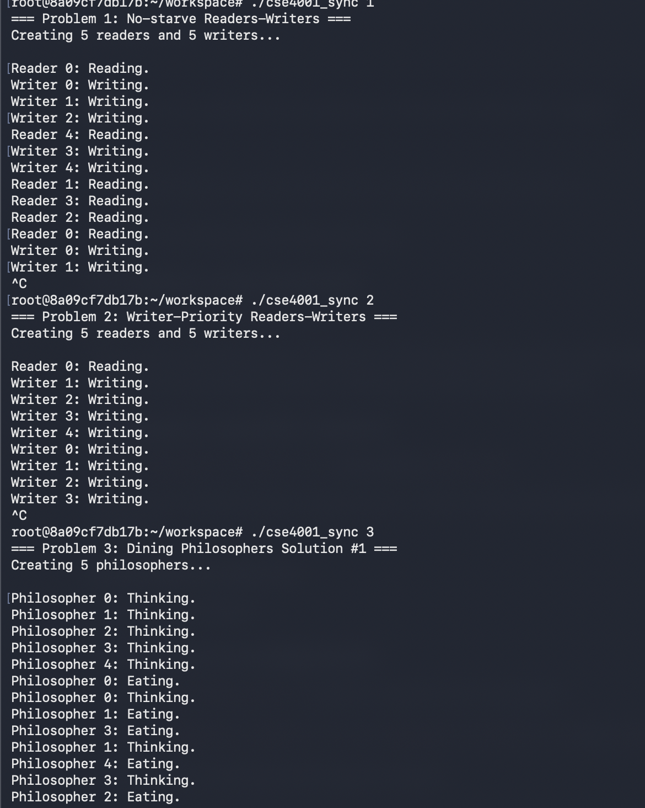
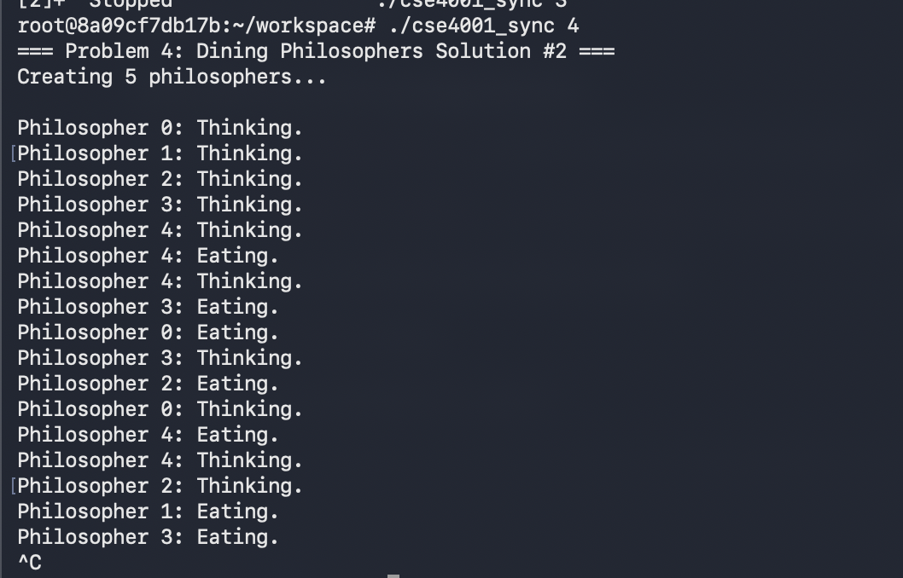

# CSE4001 Synchronization Assignment

## Overview

This project implements 4 synchronization problems using semaphores:

1. No-starve Readers-Writers (5 readers, 5 writers)
2. Writer-Priority Readers-Writers (5 readers, 5 writers)  
3. Dining Philosophers Solution #1
4. Dining Philosophers Solution #2

## How to Compile

Just use the makefile:

```bash
make
```

## How to Run

Run the program with a number 1-4 for which problem you want to test:

```bash
./cse4001_sync 1
./cse4001_sync 2
./cse4001_sync 3
./cse4001_sync 4
```

Press Ctrl+C to stop the program.

Solutions:




